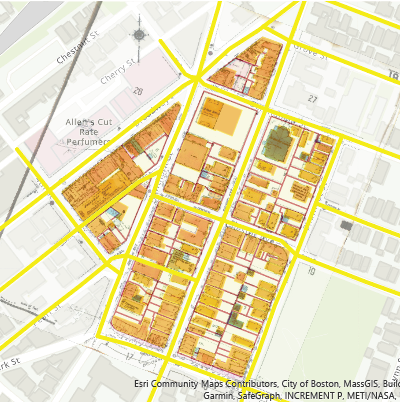
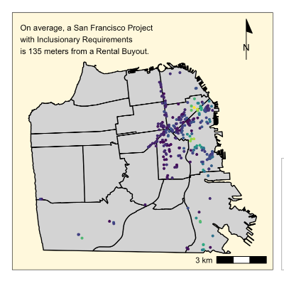
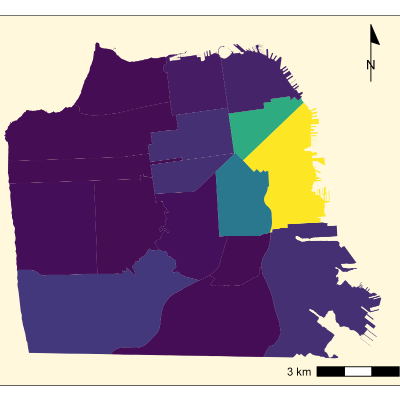

```{r setup, include=FALSE}
knitr::opts_chunk$set(echo = TRUE)
```

# Introduction

For the first semester of the master in urban planning program at Harvard's Graduate School of Design, students like myself are introduced to the tools and techniques of spatial analysis. What follows is a series of outputs intended to demonstrate a range of skills learned in the program.

# Chelsea On Fire
**How have Chelsea’s historic fires shaped its urban form and function? What role does insurance as a financial product have on the urban form?**

Our group began with an interest in the impact of two significant fires on the city of Chelsea. In our research with the maps librarians, we encountered Sanborn Maps and the detailed accounting that came about with the expansion of property insurance beginning in the late 1800s. Produced by the Sanborn Map Company, these widely spread and intricately detailed city maps were produced for insurance companies in order to assess their liability and maintain a record in the event of a fire incident. Liability details went beyond addresses, owners and floor plans to include the location of fire escapes, the presence of sprinklers, and even the kinds of cladding on windows. Our basemap is a historic map from 1935. 

[](https://mcmcmca.github.io/mca_portfolio/fullsize/chelsea_fullsize.pdf){target="_blank"}

*This map demonstrates the following skills:*

* Georeferencing a raster image
* Displaying multiple vector layers on the same map

# Salt Lake City: A Place in Transition
**What strengths and gaps exist in Salt Lake City's public transit network?**

Salt Lake City is a classic example of West Coast sprawl -- a city built with the car at the center of its design and a growth mindset in a negative sense. As SLC, like many of its American counterparts, begins re-examining its climate impact, it looks to reduce its car-dependency by enhancing its public transit system, managed by the Utah Transit Authority. The following maps offer a snap shot of current accessibility for residents to public transit options. 

## Map 1

[](https://mcmcmca.github.io/mca_portfolio/fullsize/slc_fullsize.pdf){target="_blank"}

*This map demonstrates the following skills:*

* Converting between raster layers and vector layers
* Displaying raster data on a map

## Map 2

[](https://mcmcmca.github.io/mca_portfolio/fullsize/slc_tansit_fullsize.pdf){target="_blank"}

*This map demonstrates the following skills:*

* Calculating and displaying accessibility, based on travel time

# A Sacramento Family Portrait
**How much of the city and specifically where are families at risk from lack of rent stabilization efforts?**

In recent years, especially accelerated by the pandemic, Sacramento recently received an influx of Bay Area tech worker transplants. Some came for the urban amenities, other came for the space to start a family. All came for affordability. The impact this has on the city's constitution will be profound. This map presents a 2010 snapshot to demonstrate the concentration of kids throughout the city, and will be best compared to the 2020 census data when the results are released.

[](https://mcmcmca.github.io/sackids/inter_rentkids.html){target="_blank"}

*This map demonstrates the following skills:*

* Displaying data on an interactive map

# San Francisco on the Move
**What can the relationship between inclusionary zoning, buyouts, and both zoning and cultural districts tell us about the city's anti-displacements efforts?**

San Francisco is an important case study for aggressive sector-driven on the character of a city.

## Map 1

We looked at the relationship between buyouts and projects in mandated inclusionary housing zones. Given over half of buyouts take place within a quarter mile of an inclusionary project, it would seem that there is a prominent impact that these developments are having on the residential makeup of a neighborhood. What the map makes clear is a tension between the buyout (displacement) of existing residence, and efforts by the city to retain housing for essential, below-market-rate wage earners. A hypothesis we have is that those that are being bought out are not staying in the area, and instead mandated affordable housing is being filled by different populations, which ultimately undermines inclusionary mandates as an anti-displacement effort, but additional data would need to be found and/or produced to add the temporal dimension of where residents move to after a buyout.

[](https://mcmcmca.github.io/mca_portfolio/fullsize/sf_fullsize3.pdf){target="_blank"}

*This map demonstrates the following skills:*

* Calculating and displaying relationships among point and polygon layers based on distance
* Displaying multiple vector layers on the same map

## Map 2

In this map, we are analyzing the number of mandated inclusionary housing development projects in each planning district. This map might tell us something about the political landscape of the city, an understanding of which districts are focused on density in their housing developments, given the inclusionary requirement for buildings over 10 units. Here we again see SOMA, despite its Cultural District designation, as the epicenter of dense development for the city. Of course this map doesn’t provide the nuance of where exactly in this large tract the density is focused, and it would be interested to see if within this area there are particular “hot zones” for dense, vertical growth, compared to areas where projects are of a smaller size.

[](https://mcmcmca.github.io/mca_portfolio/fullsize/sf_fullsize2.pdf){target="_blank"}

*This map demonstrates the following skills:*

* Aggregating point data to a layer of polygons
* Displaying multiple vector layers on the same map